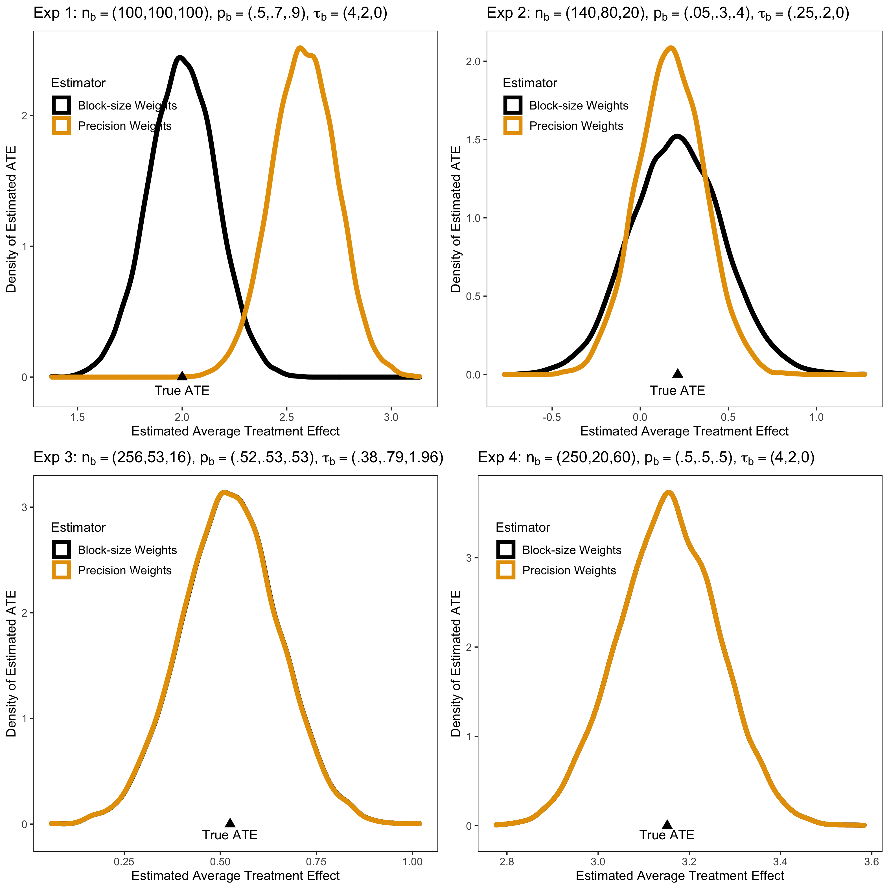

Four field experiments meet at the polished wooden bar of their neighborhood coffee shop.

"Y'all do not look like the bright and energetic agents of evidence-based
policy making that I am used to seeing each morning. What is up?" The barista
climbs down from dusting the sign hanging over the rows of coffee cups and tea
pots lining the wall behind the bar and turns to the customers. The sign says,
"No Rules of Thumb".

"We are block randomized today.", grumps the first experiment.

"Randomizing treatment assignment within pre-defined strata or blocks was
supposed to make our findings more precise without adding any more
complications to our analyes.", sighs the second experiment.

"Yeah. They said, `A block-randomized experiment is just a series of
independent mini-experiments. And you already know how to analyze them.'. And,
of course, we do, but now we can't agree on how to estimate our average
treatment effects and standard errors.", explains the third.

"And it just doesn't matter how we estimate our effects. Fixed-effects,
schmixed effects.", mutters the fourth, "I keep telling them. But they won't
listen."

"But," the barista blasts a bit of steam from the steam wand and sets two sleek
black digital scales on the counter, "aren't block randomized experiments just
series of small independent experiments? Within each block you should be able
to estimate the ATE and SE, right? And so you just need to combine those all
together somehow, right? So it should be simple, right?"

"Ah," the first experiment leans over to look at what the barista is doing, "Right. None of has very small blocks --- like we each only have three blocks and we have more than 10 people in each block. So we can calculate randomization-justified ATEs and SEs within each block.  But we are arguing about the weights. Say I found an effect of 5 in one block and 0 in another block. Should the overall effect just be $(5+1)/2=3$? What if the first block has 100 people and second block has 10 people?  Shouldn't the effect be $(5 \times 100)/110 + (1 \times 10)/110 = `r round(5*100/110 + 1*10/110,2)`$?"

"So, you are saying that you should combine block-level estimates using the
proportion of the total sample in the block as a weight?" the bartender is
pouring some new coffee beans into bowls set on each scale. "That makes sense
to me. Why don't y'all just do that? You don't want your overall effect to
overrepresent what happened in the small block, right? You have a lot more
information about the treatment effect in the bigger block and so that
information should play a bigger role in the overall story of the experiment."

"We should," says the first experiment a bit grumpily, "after all lots of previous literature tells us that this block-size weighted estimator that is unbiased. For example, we have been reading @gerber2012field (Chapter 3) and [The trouble with 'controlling for' blocks](https://declaredesign.org/blog/biased-fixed-effects.html) which make exactly this argument."

"By the way, what are you doing with the scales this morning? Usually you just start making our regular drink orders." The second experiment is also looking at the scales, bowls, and beans.

"Oh. Well, these are new beans. I know that a good espresso depends on striking a balance between bitter and sour. And, in general, and with the beans I'm used to getting, I know that about 17 grams of beans ground at about level 2 and extracted at 9 psi for about 24 seconds makes a good double shot using this grinder and this machine and humidity more or less like this in the shop. But, since these are new beans I have to explore the values of these variables a bit before deciding about the right balance. I'll be back to pulling shots quickly tomorrow. Today, however, I need to make some coffees that I may not use, to learn how to make good coffee with these beans. Just a sec, it will be noisy while I grind this." With the newly ground beans the barista puts a scale under an cup, zeros out the weight, starts a timer, and starts the espresso machine. "So, back to field experiments, why don't you just use the idea that blocks with more information should contribute more to the estimate and get back to enjoying your day?"

"Well, that is kind of the problem," says the second experiment a bit wearily, as if rehashing an old argument, "it is very expensive to do policy-relevant field experiments --- so we would often be happy to trade a little bit of bias for increases in precision, and we know that a different form of weighting is optimal from that perspective, see @kalton1968, page 199 of @gerber2012field or even the derivations for the optimal weight to diminish the size of the variance of a weighted average on wikipedia, or the related derivations in @hansen2008cbs."

"Just go ahead and explain the intuition behind the precision-weighting approach", third experiment gestures to the barista, "Meanwhile, I'm happy to help you test free espresso shots while you figure out your own procedure."

"Look, take the example of two blocks, but imagine that they each have 100 people. But now imagine that one block had assigned 50 people to treatment and 50 to control, but in the second block the administrators of the program in that block only let you randomize 5 people to treatment. Obviously the first block, with 50 in each of the arms, tells us a lot more about the treatment effect than the second block, with only 5 people in the treatment condition. But both blocks are the same size. And the block-sized weights will over-emphasize the effects in the 5 treated-person block. We should instead weight by **both** block-size **and** proportion assigned to treatment --- the second block should get a lower weight in this case."

The barista strokes his moustache while the sound of grinding coffee drowns out further conversation. When the grinding stops, he asks, "Ok. That makes sense. So, when you have blocks of different sizes, you should use that more precise weight, the 'precision-weight', and when you have blocks of the same size, both weights should be the same, so then the 'precision-weight' would just be the same as the 'block-size weight'. So you should just use that precision weight always if you want to follow the intuition that overall estimates should reflect blocks with more information, huh? You are actual experiments. I just make coffee. Shouldn't you have figured that out?"

"Well, first, you should know that there are more than two ways to calculate these weights. You should see @pashley2020blocked and @pashley2020blkvar to learn about estimating average treatment effects and their standard errors in all kinds of block randomized experiments --- including pair-randomized experiments where you really can't calculate standard errors within pair. We block randomized experiments raise lots of interesting statistical problems." The fourth experiment looks a bit proud to say this. The others chuckle.

"Well. What is the problem then?" the barista tamps the first shot, "You have lots of guidance. Just follow that advice."

"The problem is that we have two rules of thumb to follow given our designs where we have a few large blocks. Some people say that we should 'use fixed effects' (we know that this is the same as saying that we should use precision-weights) and other people say that we should use block-size weights." complains the third experiment.

"I see," the barista pulls the first shot and the sound of foaming milk fills the air, "When I was first learning to make espresso and cappuccino, I found a lot of advice on the internet. But, that advice didn't work all the time, in all situations. I really liked the advice from the chemists --- and it gave me good starting places, for example, but nice graphs of acidity by particle size don't really tell me what to do in detail with one particle size and one kind of beans. I have to make my own decision about this, knowing that I do not have an ultra clean lab and fancy equipment. So, I've found I sometimes need to play around, try different approaches to see what works. I only do this when I get new beans, or a new grinder, or something else changes, of course. It would be waste of time and money to have to throw away a lot of espresso every morning." The barista pats the gigantic espresso machine with some affection. "Can you do something like this? Try each approach?"

"Hey. This third espresso is better than the first, by the way." The fourth experiment drums fingers on the bar and taps toes on the brass footrest of the bar stool and addresses the other experiments, "Good idea! We have the [DeclareDesign](https://declaredesign.org/) package that we can use. Why don't we compare the two approaches?" The other experiments nod. "We'll take our cappucinos at the table while we work, if you don't mind. Sorry to step away from helping your coffee research."

"Sure. No problem." The barista motions them away. "I'll be interested to hear what you find."

(TIME PASSES)

"Hey, look at this!" the experiments have come back to the counter carrying their empty coffee cups and holding up one of the their laptops to show a figure. The morning rush is over. The barista is wiping down the bar.

```{r results, echo=FALSE, out.width='80%',fig.align='center',fig.cap='Estimated ATE Distributions for Four Block-randomized experiments. 10,000 simulations of each design holding the population fixed. Precision weights work best for experiment 2, worst for experiment 1, and the same as block-size weights for experiments 3 and 4.'}

```

"Wow! I didn't realize that your designs were so different." the barista stops wiping down the counter. "It is like one of you is a light roast from Ethiopia and the other is a dark roast blend!"

"Yep. It looks like neither rule of thumb worked for all four of us. We even did 10,000 simulations where we re-shuffled treatment assignment within our three blocks differently for each simulation." the first experiment puts down the laptop. "I really should not use the precision-weights or fixed-effects approach. Look at how far off from the truth my estimates would have been! Glad I didn't follow that rule of thumb!"

"Is that the gold line in the bottom left panel?", the barista puts on his reading glasses from the pocket in his work shirt. "You had 100 people in each block, randomly assigned 50%, 70% and 90% of people in each of the blocks to treatment, and the treatment effects were 4, 2 and 0 standard deviations?"

"Yes. I'm labeled 'Exp 1'. My blocks were administrative units and one of the adminitrators really  wouldn't participate unless nearly everyone got the treatment. The intervention clearly was ultra effective in some places and not in others."

"That gold distribution looks like it is a narrower distribution, but it so far away from the truth that I wonder whether the confidence intervals created using that as the center would ever cover the truth." The barista leans over the screen.

"Those confidence intervals really did a terrible job. You are correct. In this case precision weights would be terrible -- although we also thought this would happen after looking at [The trouble with 'controlling for' blocks](https://declaredesign.org/blog/biased-fixed-effects.html)." The first experiment nods.

"But, in my case, precision weights are best", Experiment 2 speaks up. "I also had a situation where the administrators of the blocks differed in their willingness to allow us to randomize but I also had differing sizes of blocks and my treatment effects were nearly the same across the blocks. Here, both confidence intervals have correct coverage, but I can detect a smaller effect if I use the precision weight. This is important to me given my smaller sample size. As you can see, if there is bias, it is tiny and didn't change the coverage of the confidence intervals."

"For both us," the third experiment points to itself and the fourth experiment, "it doesn't matter which weight we use. We were worried for no reason."

"Well, if you had been in the situations of the other two experiments, you would have had reason to worry. Good thing you did those simulations." The barista takes the empty coffee cups to the sink.  "That looked like a lot of work. Would you like another coffee? It would be on house given how much you've taught me today."

"It was some work, but the simulations were not so difficult to execute. We can put all of the code up on on [our github repository](https://github.com/egap/standards_discussions/block_rand) so your other customers can use it." The fourth experiment opens a computer and starts to type.

The barista smiles. "That would be great. It is good to know that doing some exploring and simulating works **both** for making a good espresso **and** also for estimating average treatment effects from block-randomized field experiments when you are in a new situation."


# References
